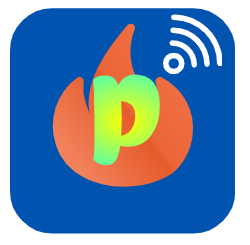

# 🌐 Portfol.io - Our Team Portfolio

Welcome to **Portfol.io**, a modern and visually stunning portfolio website designed to showcase the creativity and expertise of a passionate team of developers and professionals. This project is built with **Svelte**, ensuring a fast, responsive, and seamless user experience.

---

## 🚀 About the Project

Portfol.io is a sleek and dynamic website that highlights the following:

- **Hero Section**: A welcoming introduction to the site with a call-to-action button to explore the team.
- **Team Section**: Meet the talented individuals behind the project, complete with photos and brief bios.
- **Responsive Design**: Fully optimized for desktop, tablet, and mobile devices.
- **Interactive Animations**: Smooth transitions and hover effects for an engaging user experience.

---

## 🛠️ Technologies Used

- **Svelte**: For building the user interface.
- **Tailwind CSS**: For styling and responsive design.
- **JavaScript**: For interactivity and functionality.

---

## 👥 Meet the Team

- **Irish M. Villanueva** - BS-Tourism  
- **Brent Kenneth O. Abrazaldo** - BS-Computer Science  
- **Shaira Embornal** - BS-Tourism  

---

## 🌟 Features

- **Neon Button Effects**: Eye-catching hover animations for buttons.
- **Smooth Transitions**: Fade and slide effects for a polished look.
- **Customizable Components**: Easily adapt the site to your needs.

